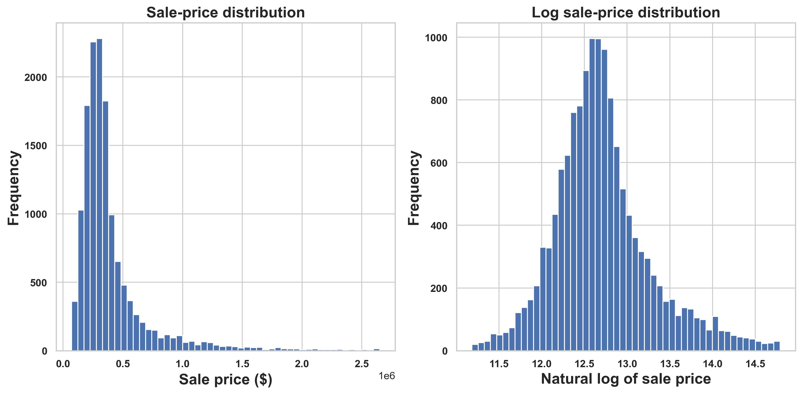
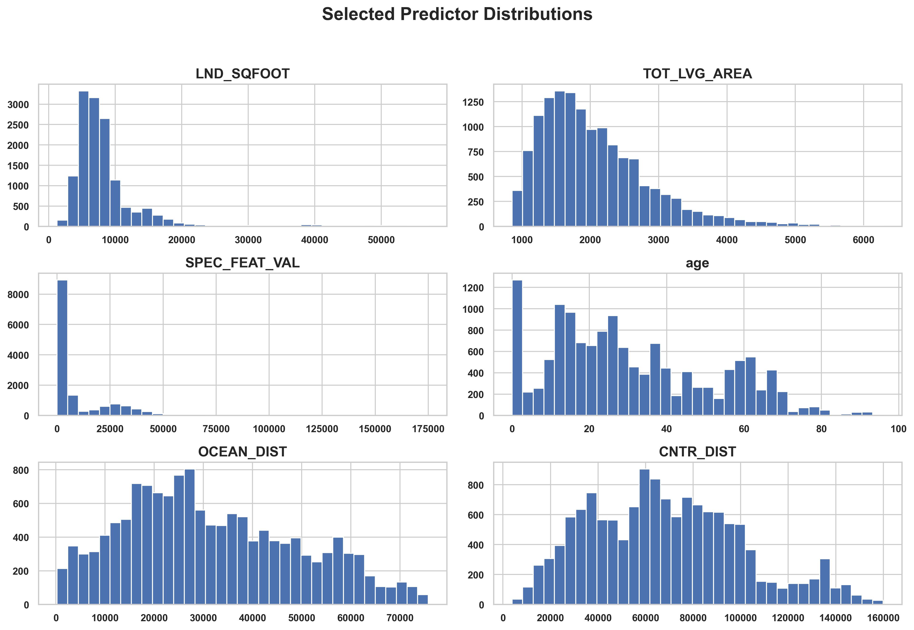
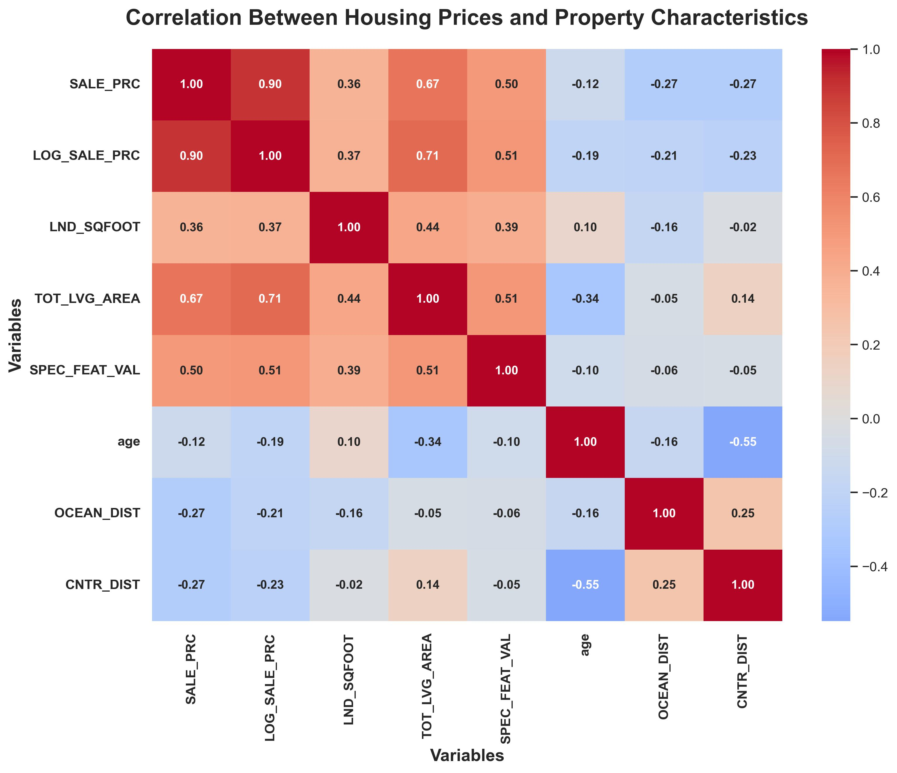
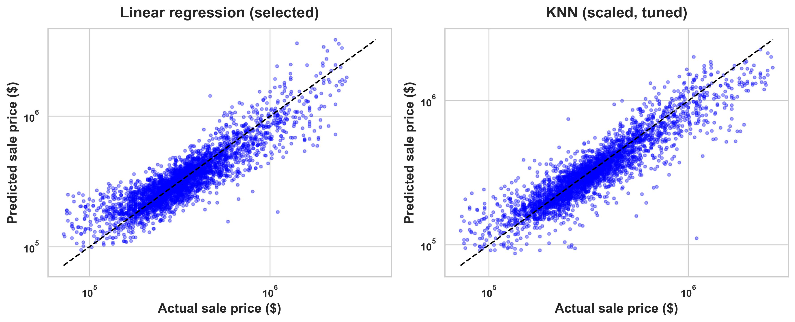

# Miami Housing Price Prediction


**Academic project | M.S. in Data Analytics | DA 523, Spring 2024**  
**Author:** Andreza Eufrasio

---

## Project overview

This project analyzes **13,932 Miami single-family property sales** to explore relationships between property characteristics and sale prices and compare multiple linear regression with K-nearest neighbors (KNN) regression. The [Jupyter notebook](miami_housing_price_prediction_complete_github.ipynb) is a revised, portfolio-oriented version of the original Spring 2024 coursework. It retains the original research question and model families while updating parts of preprocessing, feature selection, and model evaluation.

---

## Questions explored

 * **What patterns appear in Miami housing prices and property characteristics?**
 * **How do Linear Regression and KNN compare when predicting sale prices?**
 * **What are the limitations of the models, and how might they perform on new data?**

---

## Dataset

The **Miami Housing Dataset**, originally obtained from Kaggle for the course project, contains **13,932 rows and 17 original columns**, including the sale-price target (`SALE_PRC`). Property characteristics include living area, land area, building age, structural quality, location, and distance to the ocean and city center. `PARCELNO` identifies a property and is excluded from modeling.

This is a historical dataset, **not a live representation of the current Miami housing market**. To reproduce the analysis, place `miami-housing.csv` in the same directory as the notebook.

---

## Analysis and methods

The notebook explains the reasoning, code, visualizations, and interpretation at each stage:

1. **Data inspection:** Review dataset dimensions, data types, summary statistics, missing values, and duplicated rows.
2. **Exploratory data analysis:** Examine sale-price and selected predictor distributions and descriptive correlations.
3. **Target transformation:** Predict the natural logarithm of sale price, `ln(SALE_PRC)`, because the original sale-price distribution is right-skewed. The transformation does not guarantee improved prediction accuracy.
4. **Data preparation:** Exclude sale price and the property identifier from predictors; encode `month_sold` and `structure_quality`; randomly split the dataset into **75% training and 25% validation** data with a fixed random seed.
5. **Linear Regression:** Fit a model using all predictors and a model using predictors chosen by forward sequential feature selection with five-fold cross-validation on the training data.
6. **KNN Regression:** Standardize predictors in a pipeline and select the number of neighbors (`k = 1` through `15`) using five-fold cross-validation on the training data.
7. **Model evaluation:** Compare all three models on the same validation dataset using R², RMSE, and MAE, and visualize actual versus predicted prices.

Feature selection and KNN tuning use only the training data; the validation dataset is reserved for the final model comparison. The analysis identifies **predictive relationships**, not cause-and-effect relationships.

---

## Exploratory data analysis

### Sale-price distribution

The original sale prices are right-skewed. Comparing their distribution with the natural-log transformation helps explain the choice of modeling target.



### Selected property characteristics

These histograms show variation in land area, living area, special-feature value, building age, and distances to the ocean and city center.



### Correlation analysis

The heatmap shows descriptive Pearson correlations among selected numerical variables. Correlation alone does not establish causation or determine which features will improve model predictions.



---

## Model evaluation and results

The revised notebook reports the following results on the **validation dataset**:

| Model | R² (log target) | RMSE (log units) | MAE (log units) |
| --- | ---: | ---: | ---: |
| Linear Regression (all 28 predictors) | 0.788 | 0.260 | 0.190 |
| Linear Regression (14 selected predictors) | 0.787 | 0.261 | 0.191 |
| KNN (scaled, tuned; k = 3) | 0.825 | 0.237 | 0.165 |

**KNN:** The scaled KNN model had the highest R² and lowest RMSE and MAE among the three models on this validation dataset.

**Linear Regression and feature selection:** Reducing the number of predictors from 28 to 14 produced nearly identical validation results. The smaller model may be easier to interpret and maintain, but this analysis did not directly test whether it reduces overfitting or multicollinearity.

**Metric interpretation:** All three metrics were calculated using **log-transformed sale prices**. RMSE and MAE are therefore in log-price units, **not dollars or percentages**. The notebook exponentiates predictions for the actual-versus-predicted dollar-price plots; it does not report dollar-scale error metrics.

---

### Actual versus predicted sale prices

Each point represents a property in the validation dataset. The dashed diagonal indicates perfect agreement; points above it are overpredictions, and points below it are underpredictions. Both axes use a logarithmic scale. Prices shown in dollars are obtained by exponentiating the models' log-price predictions; the models were not trained separately on dollar prices.



---

## Limitations and future work

The models were evaluated using a randomly selected validation set from the original Miami housing dataset. Their predictive performance on future housing sales or properties in other geographic areas has not been tested. Additionally, the results identify relationships between property characteristics and sale prices but do not establish cause-and-effect relationships.

Future work could evaluate the models using more recent housing data or properties from other geographic areas to assess their ability to generalize to new data. Additional regression models, such as Random Forest and Gradient Boosting, could also be explored to determine whether they improve predictive performance, as measured by R², RMSE, and MAE.

---

## Original academic project and revised notebook

The original Spring 2024 course report recorded **R² = 0.81, RMSE = 0.25, and MAE = 0.18** for Linear Regression and **R² = 0.86, RMSE = 0.21, and MAE = 0.15** for KNN (`k = 4`). The revised notebook uses updated model-selection and preprocessing procedures, including training-only cross-validation and a scaled KNN pipeline. The two sets of results describe **different experimental workflows** and should be considered separately.

---

## Repository structure

```text
miami-housing-price-prediction/
├── README.md
├── miami_housing_price_prediction_complete.ipynb
├── requirements.txt
├── images/
│   ├── miami_banner.png
│   ├── sale_price_distribution.jpg
│   ├── predictor_distributions.jpg
│   ├── correlation_heatmap.jpg
│   └── actual_vs_predicted_sale_prices.jpg
└── miami-housing.csv  # Place here locally; share only if redistribution is permitted
```

---

## How to run the notebook

1. Clone or download this repository.
2. Place `miami-housing.csv` in the same directory as `miami_housing_price_prediction_complete_github.ipynb`.
3. Install the dependencies:

   ```bash
   pip install -r requirements.txt
   ```

4. Open the notebook in Jupyter and run the cells in order.

For the full methodology, code, results, and interpretation, see the [complete Jupyter notebook](miami_housing_price_prediction_complete.ipynb).
